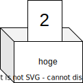

import ViewSource from "@site/src/components/ViewSource";
import Answer from "@site/src/components/Answer";

# <ruby>変数<rt>へんすう</rt></ruby>〜名前のついた箱〜

ここでは、プログラミングでとても<ruby>大切<rt>たいせつ</rt></ruby>な「<ruby>変数<rt>へんすう</rt></ruby>」について学びましょう。

## 変数って何ですか？

例えば、<ruby>音<rt>おと</rt></ruby>が<ruby>伝<rt>つた</rt></ruby>わる<ruby>速<rt>はや</rt></ruby>さを計算してみましょう。
音の速さは、そのときの<ruby>気温<rt>きおん</rt></ruby>によって変わります。気温を $t$ とすると、音の速さ $V$ はだいたい下の<ruby>式<rt>しき</rt></ruby>で計算できます。

$$
V=331.5+0.6t
$$

まずは、そのまま計算してみますね。

<ViewSource path="/variables/sound_velocity.ipynb" />

これでも計算できますが、もし「気温が 10度ではなくて 20度のときは？」と思ったら、プログラムの中の数字を全部書きかえなければいけません。これは少し<ruby>面倒<rt>めんどう</rt></ruby>ですよね。

そこで、「<ruby>変数<rt>へんすう</rt></ruby>」の<ruby>出番<rt>でばん</rt></ruby>です！
変数は、**「<ruby>数字<rt>すうじ</rt></ruby>や<ruby>文字<rt>もじ</rt></ruby>を入れておける、名前のついた箱」** だと思ってください。



例えば、`t` という名前の箱に `10` を入れておけば、あとで「やっぱり 20度がいい！」と思ったときに、箱の中身を `20` に入れかえるだけで、プログラム全部が新しい数字で動くようになるのです。

<ViewSource path="/variables/sound_velocity_revised.ipynb" />

どうでしょうか？ `t = 20` と書きかえるだけで、計算の<ruby>結果<rt>けっか</rt></ruby>が変わります。とても<ruby>便利<rt>べんり</rt></ruby>ですね！

<ViewSource path="/variables/sound_velocity_revised_20degree.ipynb" />

:::tip `=` の意味
プログラミングの<ruby>世界<rt>せかい</rt></ruby>では、`=` は「同じ」という意味ではなく、 **「右側のものを、左側の箱に入れる」** という意味です。
例えば、`x = 2` と書いたら、「`x` という箱に `2` を入れるよ！」ということです。
:::

:::note 箱の名前のつけ方
Python では、箱の名前にスペースを入れることができません。
言葉をつなげたいときは、 `sound_speed` のように `_`（アンダーバー）を使ってつなげることが多いです。これを「スネークケース（ヘビさん形式）」と<ruby>呼<rt>よ</rt></ruby>んだりします。
:::

### <ruby>練習問題<rt>れんしゅうもんだい</rt></ruby> 1

前にやった「摂氏（せっし：C）」から「華氏（かし：F）」を出す計算を、変数を使ってやってみましょう！
$C = 20$ としたとき、$F$ はいくつになるでしょうか？

$$
F=\frac{9}{5}C+32
$$

<Answer>
  <ViewSource path="/variables/to_fahrenheit.ipynb" />
</Answer>

### 練習問題 2

次のプログラムを<ruby>実行<rt>じっこう</rt></ruby>すると、最後に<ruby>画面<rt>がめん</rt></ruby>には何が出てくるでしょうか？考えてみてください。

```python
x = 2
y = 3
y = x + y
y
```

<Answer>

3行目で、`x`（2）と `y`（3）を足した答え（5）を、あたらしく `y` の箱に入れています。
ですから、答えは `5` になります！

  <ViewSource path="/variables/substitution_practice.ipynb"/>
</Answer>
