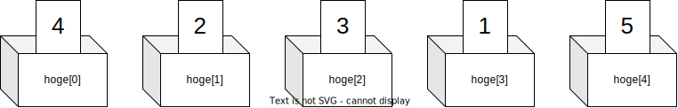

import ViewSource from "@site/src/components/ViewSource";
import Hint from "@site/src/components/Hint";
import Answer from "@site/src/components/Answer";

# たくさんのデータをまとめよう。〜<ruby>配列<rt>はいれつ</rt></ruby>〜

ここでは、たくさんの<ruby>数字<rt>すうじ</rt></ruby>や<ruby>文字<rt>もじ</rt></ruby>をひとまとめにする「<ruby>配列<rt>はいれつ</rt></ruby>」を学びましょう。

## 配列ってなに？

たとえば、クラス 5人のテストの点数（96点、56点、42点、74点、86点）の<ruby>平均<rt>へいきん</rt></ruby>を出したいとしましょう。
これをふつうの<ruby>変数<rt>へんすう</rt></ruby>でやろうとすると、箱を5つも用意しなければいけません。

そこで使うのが「配列」です。配列は、 **「たくさんの数字が<ruby>順番<rt>じゅんばん</rt></ruby>にならんだ、長い入れ物」** だと思ってくださいね。電車の<ruby>車両<rt>しゃりょう</rt></ruby>がつながっているみたいですね。



配列を使えば、for 文といっしょに使うことで、100人でも1000人でも、かんたんに合計や平均をだせるようになります。

<ViewSource path="/array/average3.ipynb" />

## 配列のルール

配列は、このように作ります。

```python
点数のリスト = [96, 56, 42, 74, 86]
```

### 何番目を取り出す？

配列の中から数字を取り出すときは、ちょっとしたコツがあります。
それは、 **「さいしょは 0番目からかぞえる」** ということです。

```python
点数のリスト[0] # これで、いちばん最初の「96」が取り出せます
点数のリスト[1] # これで、2番目の「56」が取り出せます
```

プログラミングの世界では、1 からじゃなくて 0 からかぞえるのがルールです。おもしろいですね。

### 配列の長さを知る

配列にいくつデータが入っているか知りたいときは、 `len`（レン）という道具を使います。

```python
len(点数のリスト) # これで「5」という答えが返ってきます
```

## <ruby>練習問題<rt>れんしゅうもんだい</rt></ruby>

### 1. 点数をかきかえましょう。
5人の点数が入ったリスト `scores` の、1番目の人の点数を `37` 点に書きかえてみましょう。

<Answer>
<ViewSource path="/array/change.ipynb" />

※ `scores[0] = 37` と書けば、いちばん最初の箱の中身を入れかえられますよ。

</Answer>

### 2. <ruby>平均点<rt>へいきんてん</rt></ruby>をだしましょう。
10人のテストの点数が入った配列を受け取って、平均点を計算してくれる機械を作ってみましょう。

<Answer>
<ViewSource path="/array/average4.ipynb" />
</Answer>

### 3. いちばん高い点数は？
配列の中にある数字の中から、いちばん大きい数字（最高点）を見つけるプログラムを作ってみましょう。

<Answer>
  <ViewSource path="/array/max.ipynb" />
</Answer>
