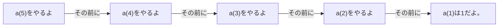

import ViewSource from "@site/src/components/ViewSource";
import Answer from "@site/src/components/Answer";
import Hint from "@site/src/components/Hint";

# <ruby>鏡<rt>かがみ</rt></ruby>の中の自分（再帰）

## 自分の中に、自分がいる？

今回は、「<ruby>再帰<rt>さいき</rt></ruby>」という<ruby>不思議<rt>ふしぎ</rt></ruby>なプログラムの書き方を学びましょう。

「再帰」というのは、**ある関数の中で、自分と同じ関数を呼びだすこと**です。

<ruby>鏡<rt>かがみ</rt></ruby>を２つ向かい合わせにすると、鏡の中に自分がいて、その鏡の中にも自分がいて……と、ずっと続いて見えますよね。あのイメージです。
ほかにも、マトリョーシカ人形みたいに、「あけたら中からまた同じ人形が出てくる」という感じに似ていますね。

## かんたんな再帰の<ruby>例<rt>れい</rt></ruby>

たとえば、1から5まで<ruby>順番<rt>じゅんばん</rt></ruby>に足していく計算を、再帰で書いてみるとこうなります。

<ViewSource path="/recursion/recurrence_relation_rec.ipynb" />

プログラムの流れを見てみましょう。

一番小さな「a(1)」がわかったら、それを順番に足して、<ruby>最後<rt>さいご</rt></ruby>に「a(5)」の答えがわかるのです。

## どんどん増える「フィボナッチ数列」

「前の２つの数字をたす」というルールで増えていく不思議な数字の列を「フィボナッチ数列」といいます。これも再帰を使うと、とてもかんたんに書けます。

$$
0, 1, 1, 2, 3, 5, 8, 13, 21, 34, \dots
$$

<ViewSource path="/recursion/fib.ipynb" />

:::note
再帰を使うと、むずかしい<ruby>計算式<rt>けいさんしき</rt></ruby>を考えなくても、ルールをそのまま書くだけで答えが出せちゃうのがよいところなのです。
:::

### 練習問題：1からnまで足してみよう

再帰を使って、1から好きな数字（n）までの和をもとめるプログラムを作ってみましょう。

<Answer>
<ViewSource path="/recursion/sum.ipynb" />
</Answer>

### 練習問題：<ruby>最大公約数<rt>さいだいこうやくすう</rt></ruby>

２つの数字をどちらも割り切れる、一番大きな数字を見つけてみましょう。これも再帰が<ruby>得意<rt>とくい</rt></ruby>なことなのです。

<Answer>
<ViewSource path="/recursion/gcd.ipynb" />
</Answer>
