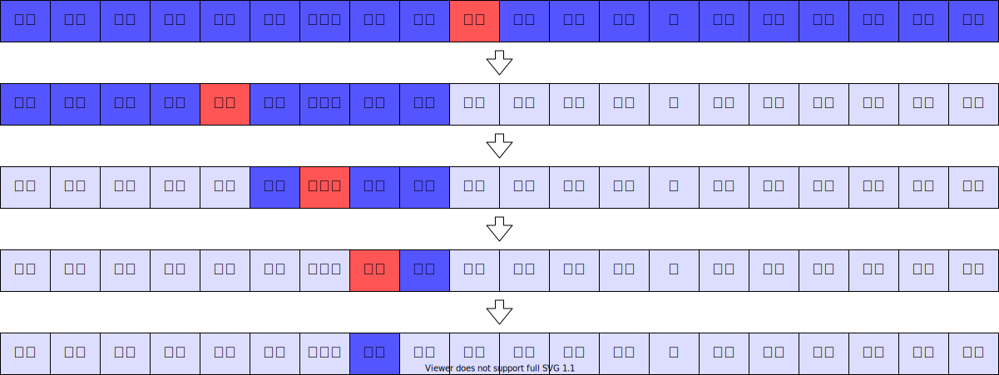

import ViewSource from "@site/src/components/ViewSource";
import Answer from "@site/src/components/Answer";

# おたずねものを見つけよう。（探索）

## サーチ（探索）ってなに？

たくさんのデータの中から、自分のほしいものを見つけることを **「<ruby>探索<rt>たんさく</rt></ruby>」** または「サーチ」といいます。

たとえば、学校の<ruby>名簿<rt>めいぼ</rt></ruby>から、<ruby>友達<rt>ともだち</rt></ruby>の名前をさがすようなものですね。

## 1. はしから順番にさがす「<ruby>線型探索<rt>せんけいたんさく</rt></ruby>」

一番かんたんなのは、一番前の人から<ruby>順番<rt>じゅんばん</rt></ruby>に「きみかな？」「ちがうね」と<ruby>確認<rt>かくにん</rt></ruby>していく方法です。

<ViewSource path="/search/linear_search.ipynb" />

この方法は、データが100個あれば、<ruby>最大<rt>さいだい</rt></ruby>で100回計算することになります。
計算量は **$O(n)$** ですね。

## 2. 辞書みたいにさがす「<ruby>二分探索<rt>にぶんたんさく</rt></ruby>」

データが「あいうえお順」に並んでいるなら、もっと速く見つける方法があります。
<ruby>辞書<rt>じしょ</rt></ruby>をひくときみたいに、真ん中のページをパッと開いてみましょう。

1. 真ん中を見る。
2. 探したい名前が、真ん中より「前」か「後ろ」か考える。
3. もし後ろなら、前の半分はもう探さなくていいですよね。
4. 残った半分で、また真ん中を見る。

これを繰り返すと、探す<ruby>範囲<rt>はんい</rt></ruby>が「半分、また半分」と、あっという間に小さくなっていきます。

この方法は **<ruby>二分探索<rt>にぶんたんさく</rt></ruby>** とよばれていて、計算量は **$O(\log n)$** です。

### どれくらい速いの？

データが100億個（。）あっても、二分探索なら、なんと **たったの34回くらい** で見つけられます。<ruby>魔法<rt>まほう</rt></ruby>みたいですね。

| データの数 | <ruby>線型探索<rt>はしから</rt></ruby> | 二分探索（半分ずつ） |
| :--- | :--- | :--- |
| 100個 | 100回 | 7回 |
| 1万個 | 1万回 | 14回 |
| 100億個 | 100億回 | 34回 |

## プログラムでやってみよう

二分探索をプログラムで書くと、こんな感じになります。

<ViewSource path="/search/binary_search.ipynb" />

:::tip
二分探索はすごく速いけれど、**「データが<ruby>順番<rt>じゅんばん</rt></ruby>に並んでいないと使えない」** というルールがあります。探す前に、ちゃんとお片付け（ソート）しておかなければいけませんね。
:::

## 練習問題

二分探索を使って、リストの中から数字をさがすプログラムにチャレンジしてみましょう。

<Answer>
<ViewSource path="/search/binary_left_practice.ipynb" />
</Answer>
