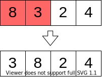

import ViewSource from "@site/src/components/ViewSource";
import Answer from "@site/src/components/Answer";

# お片付けをしよう！（並べ替え：ソート）

## ソートってなに？

バラバラに並んだカードや数字を、小さい順（1, 2, 3...）や、あいうえお順にきれいに並べ替えることを **「ソート」** といいます。

日本語では「<ruby>整列<rt>せいれつ</rt></ruby>」や「並べ替え」ともいいますね。

## どうやって並べ替えるの？

並べ替えのやり<ruby>方<rt>アルゴリズム</rt></ruby>には、実はいろいろな<ruby>種類<rt>しゅるい</rt></ruby>があります。代表的なものを２つ<ruby>紹介<rt>しょうかい</rt></ruby>しましょう。

## 1. となり同士を比べる「バブルソート」

バブルソートは、となりにある数字と大きさを比べて、もし順番が<ruby>逆<rt>ぎゃく</rt></ruby>だったら入れ替える、というのを繰り返す方法です。

大きい数字がだんだん後ろに<ruby>移動<rt>いどう</rt></ruby>していく様子が、水の中の「あわ（バブル）」がぷくぷく上がっていくみたいですから、この名前がついたのです。

<ViewSource path="/sort/bubble_sort.ipynb" />

:::info
この方法はとってもわかりやすいですが、データがたくさんあるときは、時間がかかりすぎてしまうのが<ruby>弱点<rt>じゃくてん</rt></ruby>なのです。
:::

## 2. 山を分けて合体させる「マージソート」

マージソートは、バブルソートよりもずっと速い、かしこい方法ですよ！

1. データの山を、半分に分ける。
2. もっと小さくなるまで、どんどん半分に分けていきます。
3. バラバラになったら、小さい順に並べながら、また<ruby>合体<rt>マージ</rt></ruby>させていきます。

<ViewSource path="/sort/merge_sort.ipynb" />

:::tip
データが何万個になっても、マージソートならあっという間に並べ替えが終わります。プロの世界では、こういう速い方法がよく使われています。
:::

## 練習問題

マージソートを使って、大きい順（10, 9, 8...）に並べ替えるプログラムを作ってみましょう！

<Answer>
  <ViewSource path="/sort/merge_sort_reverse.ipynb" />
</Answer>

## 便利な道具を使おう

Pythonには、自分で作らなくても最初から並べ替えをしてくれる便利な<ruby>魔法<rt>まほう</rt></ruby>が用意されています。

<ViewSource path="/sort/sort.ipynb" />

:::note
ほかにも、「ボゴソート」というおもしろい方法があります。
これは、**「きれいに並ぶまで、何度もバラバラに混ぜつづける」** という、とても運まかせな方法です。いつ終わるかわからないから、実際に使うのはおすすめしませんよ！

<iframe
  width="100%"
  style={{ aspectRatio: "16/10", height: "auto" }}
  src="https://www.youtube.com/embed/kPRA0W1kECg"
  title="YouTube video player"
  frameborder="0"
  allow="accelerometer; autoplay; clipboard-write; encrypted-media; gyroscope; picture-in-picture; web-share"
  allowfullscreen
></iframe>
:::
